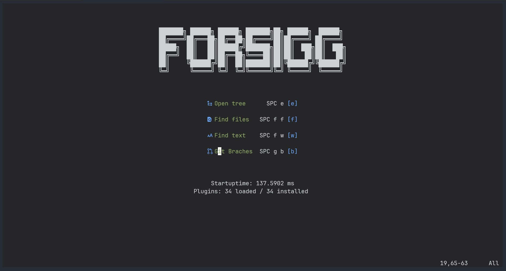
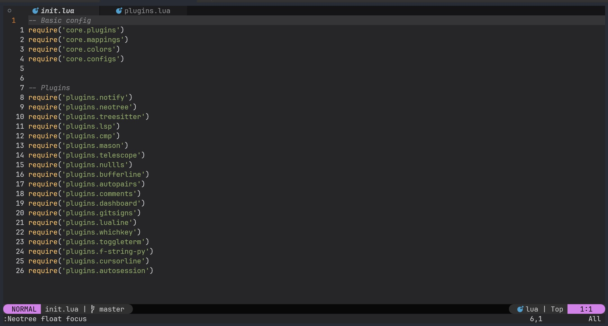

# My Nvim configuration

## Screenshots:

## Features

- Language Server Protocol support for Python
- Formatting Python support
- Tree-based directory view (Treesitter)
- Search by word, filename (Telescope)
- Session support
- Multi window buffer

## Plugins

- "auto-session"
-  "bufferline.nvim"
-  "cmp-buffer"
-  "cmp-cmdline"
-  "cmp-nvim-lsp"
-  "cmp-path"
-  "darcula-solid.nvim"
-  "dashboard-nvim"
-  "f-string-toggle"
-  "gitsigns.nvim"
-  "hop.nvim"
-  "lazy.nvim"
-  "lualine.nvim"
-  "lush.nvim"
-  "mason-lspconfig.nvim"
-  "mason.nvim"
-  "neo-tree.nvim"
-  "nui.nvim"
-  "null-ls.nvim"
-  "nvim-autopairs"
-  "nvim-cmp"
-  "nvim-comment"
-  "nvim-cursorline"
-  "nvim-lspconfig"
-  "nvim-notify"
-  "nvim-treesitter"
-  "nvim-web-devicons"
-  "nvim-window-picker"
-  "onedark.vim"
-  "plenary.nvim"
-  "telescope.nvim"
-  "toggleterm.nvim"
-  "vim-log-highlighting"
-  "which-key.nvim"
-  "virtcolumn.nvim"
